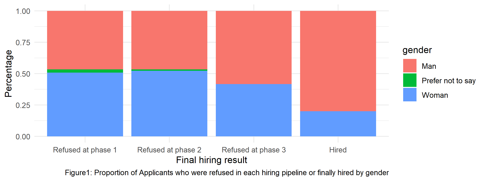
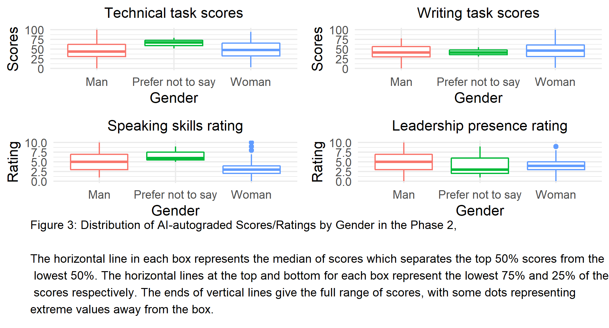
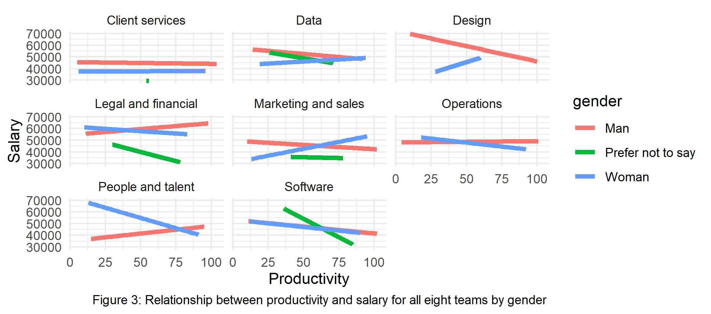
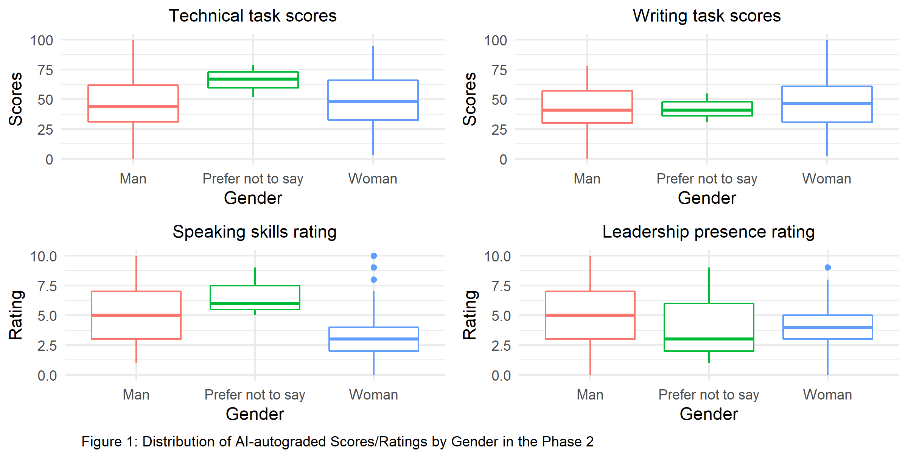

```{r, message = FALSE, echo=FALSE}
library(tidyverse)
library(dplyr)
library(lme4)
library(gtsummary)
library(gridExtra)
library(grid)
library("FrF2")
# this should supress all code and messages
knitr::opts_chunk$set(include = FALSE)
```

\newpage
# Executive summary

## Background & Aim 
Concerns about potential bias in the hiring and remuneration processes were consistently raised internally in Black Saber Software. In order to investigate the true fact for the issues, we SFP were consent to help figure it out. This report was commissioned to examine if potential issues especially gender parity existed in the hiring, promotion and salary processes based on the hiring data and data about promotion and wages for current employees provided by Black Saber Software . Besides, we were interested in the fact how the new trialled AI service performanced in the hiring process. 

## Key results 
* Only 2.7% of man and 0.6% were finally hired while no people with gender prefer not to say hired in the hiring process.
* In the first and second hiring phases, the percentage of applicants who can proceed to next phase was
approximately evenly split between gender.
* No great gender difference was found in the AI-autograded scores in the phase 2.
* The hiring process showed fairness in each phases based on candidates' talent and value to BBS.
* In most of teams, current employees with higher productivity had lower productivity especially for those who prefer not to say their gender which indicates potential bias existed in the salary process.
* Regarding leadership for level, only men were labled beyond expectation and only women were labled need improvement so it seemed unfair in the promotion process. 

## Limitations
We were only offered with data for current employees so it was hard to know reasons past employees left. If additional data related to past employees can be provided, we can have a more deep and comprehensive sight into potential biases;\
The lack of ethnicity/race data also results in a limitation since race might be a potential exist which might influence the results of hiring pipelines and promotion and amount of wages;\
No information about the determination methods for hiring results, promotion and amount of salary was provided which limited the accuracy of models we fit for these processes.

\newpage
Key results of the study are summarized in the following tables: \


 

\newpage
# Technical report

## Introduction

Recently, several complaints were received related to potential bias in the hiring and remuneration processes. Hence, BSS (Black Saber Software) required our team to take a look and give out a related report for the Board of Directors. The purpose of this study is to investigate if BSS’s hiring, promotion, and salary were processing fairly based on talent and value to the company. We were especially interested in exploring potential gender bias in the hiring and remuneration processes. Besides, we also investigated the performance of the new AI service in the hiring pipeline. Data was provided by the data team from BSS including hiring data for their new graduate program and data for their current employees. 

In this report, we will specify different explanatory and response variables for hiring and remuneration processes.. Then, we will do some exploratory data analysis and then fit several generalized linear models and a linear mixed effects model to analyze the results. At the end, we will point out the same limitations of our model. The whole report will be run on R.studio and knit into pdf.


## Research questions
Throughout the analysis, we focused on investigating the fairness in the hiring, promoting, and salary processes at Black Saber Software. Below are our questions of interest:\
* Does the new AI service in the hiring pipeline work and is reliable for future use? \
* If the applicantes are hired in the hiring process based on their ability and value to BSS? \
* Is gender a potential bias during the promotion and salary processes? \

\newpage
## Possible future use of AI service in the hiring process \
**\underline{Data Organization}**  

We considered a data set named all_phase combining all necessary data in the hiring process which include four datasets : phase1-new-grad-applicants-2020.csv, phase2-new-grad-applicants-2020.csv, phase3-new-grad-applicants-2020.csv and final-hires-newgrad_2020.csv. Each line of all_phase contains all aggregated information of an applicant in the hiring pipelines. In this analysis for hiring process, the response variable is the result.
Examination of data for hiring process reveals the following key variables in all_phase:\

| Variable | Description|
|:---------|:------------------------|
|applicant_id | Unique identifier assigned to candidates in Phase 1| 
|team_applied_for |Data or Software |
|gpa | 0.0 to 4.0 |
|extracurriculars |Indicates the quality of extracurricular involvement with scores of 0,1,2 |
|work_experience | Description of candidates’ previous work experience with scores of 0,1,2 |
|technical_skills| Score from 0 to 100 on a timed technical task, AI autograded|
|writing_skills |Score from 0 to 100 on a timed writing task, AI autograded |
|speaking_skills | A rating of speaking skills based on pre-recorded video, AI autograded |
|leadership_presence | A rating of leadership presence based on pre-recorded video, AI autograded |
|final_result | Indicate at which phase applicant was rejected or hired finally |
|result |Show the hiring result for each applicant in each hiring pipeline |

\newpage

**\underline{Data Wrangling and Visualization}**\

We first joined all phases' data togethger in the dataset called all_phase, and then create a newe variable called final_result telling us whether an applicant was rejected at each phase or finally hired. And we also created another new variable called result for each phase which can indicate whether the applicant passes or not. Since our main purpose was to see whether AI service worked in the hiring process, we made some plots for scores of AI-autograded tasks by gender in phase2.  \

```{r, echo=FALSE, warning=FALSE, message=FALSE}
# read in the data
black_saber_current_employees <- read_csv("data/black-saber-current-employees.csv")
phase1 <- read_csv("data/phase1-new-grad-applicants-2020.csv")
phase2 <- read_csv("data/phase2-new-grad-applicants-2020.csv")
phase3 <- read_csv("data/phase3-new-grad-applicants-2020.csv")
final <- read_csv("data/final-hires-newgrad_2020.csv")
#join three datasets into one.
phase1_2 <- full_join(phase1,phase2)
all_phase <- left_join(phase1_2, phase3, by = "applicant_id")
final_applicant <- left_join(final, all_phase, by = "applicant_id") 
all_phase$final_result <- ifelse(all_phase$applicant_id %in% final_applicant$applicant_id, "Hired",          
                           ifelse(all_phase$applicant_id %in% phase3$applicant_id,"Refused at phase 3",  
                           ifelse(all_phase$applicant_id %in% phase2$applicant_id,"Refused at phase 2","Refused at phase 1")))
all_phase$final_result <- factor(all_phase$final_result,level=c("Refused at phase 1","Refused at phase 2","Refused at phase 3","Hired"))
# create new variables to show the hiring results for each candidates in each phrase
phase1$result <- ifelse(phase1$applicant_id %in% phase2$applicant_id,"proceed","refused")
phase2$result <- ifelse(phase2$applicant_id %in% phase3$applicant_id,"proceed","refused")
phase3$result <- ifelse(phase3$applicant_id %in% final$applicant_id,"proceed","refused")
all_phase$result <- ifelse(all_phase$applicant_id %in% final$applicant_id,"Hired","no")

all_phase %>% 
  tbl_summary(by = gender,
    statistic = list(all_continuous() ~ "{mean} ({sd})",
                     all_categorical() ~ "{n} / {N} ({p}%)"),
    digits = all_continuous() ~ 2)

# check AI service biased or not in Phase 2
AI_technical<-phase2 %>%
  ggplot(aes(x= gender,y=technical_skills,color=gender)) +
  geom_boxplot()+
  theme_minimal()+
  theme(legend.position = "none",plot.title = element_text(hjust = 0.5, size = 11))+
  labs(x= "Gender", y="Scores",title="Technical task scores")
AI_writing<-phase2 %>%
  ggplot(aes(x= gender,y=writing_skills,color=gender)) +
  geom_boxplot()+
  theme_minimal()+
  theme(legend.position = "none",plot.title = element_text(hjust = 0.5, size = 11))+
  labs(x= "Gender", y="Scores",
       title="Writing task scores")
AI_speaking<-phase2 %>%
  ggplot(aes(x= gender,y=speaking_skills,color=gender)) +
  geom_boxplot()+
  theme_minimal()+
  theme(legend.position = "none",plot.title = element_text(hjust = 0.5, size = 11))+
  labs(x= "Gender",y="Rating",title="Speaking skills rating")
AI_leadership<-phase2 %>%
  ggplot(aes(x= gender,y=leadership_presence,color=gender)) +
  geom_boxplot()+
  theme_minimal()+
  theme(legend.position = "none",plot.title = element_text(hjust = 0.5, size = 11))+
  labs(x= "Gender",y="Rating",title="Leadership presence rating")
# create a 2x2 plot to show all AI-autograded socres by gender
AI_check <-grid.arrange(AI_technical, AI_writing, AI_speaking, AI_leadership,
                         nrow=2,ncol = 2, bottom = textGrob("Figure 1: Distribution of AI-autograded Scores/Ratings by Gender in the Phase 2", x = 0.09, y = 0.6, just = "left", gp = gpar(fontsize = 9)))
ggsave(file="images/AI_check.png", AI_check ,height = 4,width=8)
# create the AI-related graph for executive summmary
AI_socres <-grid.arrange(AI_technical, AI_writing, AI_speaking, AI_leadership,
                         nrow=2,ncol = 2, bottom = textGrob("Figure 2: Distribution of AI-autograded Scores/Ratings by Gender in the Phase 2 \n\nThe horizontal line in each box represents the median of scores which separates the top 50% scores from the\n lowest 50%. The horizontal lines at the top and bottom for each box represent the lowest 75% and 25% of the\n scores respectively. The ends of vertical lines give the full range of scores, with some dots representing \nextreme values away from the box.", x = 0.09, y = 0.6, just = "left", gp = gpar(fontsize = 9)))
ggsave(file="images/AI_scores.png", AI_socres ,height = 3.5)
```



Figure 1 presented a five-number summary: the minimum, the maximum, the sample median, and the first and third quartiles based on different genders for the scores or ratings by AI service. We can see generally there is no difference of scores or ratings between man and women since in all the four plots, man and women gave the similar five-number smmary results. But in the technical task scores plot, the boxplot for people with gender prefer not to say was not overlapped with other two boxplots for man and woman so there might be a significant difference between gender in scores rated by AI and we need to do further analysis.

\newpage

**\underline{Models}**\

Since our response variable has only two levels : hired or no which is equivalent to binary variale, generalized linear model came out immediately. As we were interested in studying whether AI service was reliable in the hiring process without potential bias, we created two different models to determine whether including the grades made by AI service. In the first model, we checked if variables in the pahse 1 are related to the final result. The second model, we contained all covariates in the phase 2 to check whether AI service had effect on the final result. \
From the p-value from result of the first model, we found that gpa and gender are significant since the p-values are smaller than 0.05. So we included them in the next model to have further analysis in order to check whether gender had impact on the hiring results. In the result of the second model, we found that gpa, leadership presence rating, speaking skills rating, technical task scores and writing task scores are all significant since the p-value is less than 0.05. Therefore, there is significant evidence that all scores and ratings made by AI service are associated with the final hiring result. And there is no evidence that gender effects the final result by using AI service. Therefore, we can conclude that AI service works and is reliable for future use without gender bias.


```{r, include=TRUE, echo=FALSE, warning=FALSE, message=FALSE}
# Create model 1 to see if several response variables are related to the final result.
model_1 <- glm(as.factor(result) ~ gpa+cv+cover_letter+extracurriculars+work_experience,
               data = all_phase, family = binomial("logit"))
tbl_regression(model_1)
#Create model 2 to see AI score preference
```

__Table 1:__ Overall Key statistical summaries of the Generalized Linear Model related to accepted applicant. \


```{r, include=TRUE, echo=FALSE, warning=FALSE, message=FALSE}
model_2 <- glm(as.factor(result) ~ gpa+extracurriculars+work_experience+leadership_presence+
                 speaking_skills+technical_skills+writing_skills, 
               data = phase2, family = binomial("logit"))
tbl_regression(model_2)
```

__Table 2:__ Key statistical summaries of the Generalized Linear Model related to AI scoring in phase 2. \

\newpage

```{r gender_parity}
# check gender distribution on final results for applicants 
bar_result_gender<-all_phase %>%
  ggplot(aes(x=final_result,fill=gender)) +
  geom_bar(position="fill")+
  theme_minimal()+
  labs(x="Final hiring result",
       y="Percentage",
       caption = str_c(" Figure1: Proportion of Applicants who were refused in each hiring pipeline or finally hired by gender"))
ggsave(file="images/bar_result_gender.png", height = 2.7, width=8)

```

\newpage 

## A potential gender bias in the salary and promotion processes
**\underline{Data Organization}** 
In the current employee data set, we have selected gender, team, leadership_for_level, productivity, and salary. We will focus on the following variables from black-saber-current-employees.csv: \

|Variable | Description |
|:-----|:--------------------|
|employee_id | Unique 5-digit employee identifier |
|gender | Gender of employee: man, woman, prefer not to say |
|team | one of the 8 teams which each employee works for |
|leadership_for_level | if the employee is appropriate for level, need improvements or exceeds expectations|
|productivity | work output with respect to job description rated on a 0 - 100 scale|
|salary | salary at the given financial quarter |

**\underline{Data Wrangling and Visualization}** 
```{r, include=TRUE, echo=FALSE, warning=FALSE, message=FALSE}
## gender, promotion, and salary
# clean the salary data for further analysis
black_saber_current_employees$salary<-gsub("\\$","",black_saber_current_employees$salary)
black_saber_current_employees$salary<-gsub("\\,","",black_saber_current_employees$salary)
black_saber_current_employees$salary<-as.numeric(black_saber_current_employees$salary)
# change the data types
black_saber_current_employees$employee_id<-as.character(black_saber_current_employees$employee_id)
black_saber_current_employees$gender<-as.factor(black_saber_current_employees$gender)
black_saber_current_employees$team<-as.factor(black_saber_current_employees$team)
black_saber_current_employees$role_seniority<-as.factor(black_saber_current_employees$role_seniority)
black_saber_current_employees$leadership_for_level<-as.factor(black_saber_current_employees$leadership_for_level)
```

```{r, include=TRUE, echo=FALSE, warning=FALSE, message=FALSE}
# check general relationship between productivity and salary for each team
productivity_salary<-black_saber_current_employees %>% 
 ggplot(aes(x= productivity,y=salary,color=gender))+
  geom_smooth(method = "lm",
              se = FALSE,
              size = 1.5) +
  facet_wrap(~team) +
  theme_minimal()+
  labs(x= "Productivity",y="Salary",
       caption = str_c("Figure3: Relationship between productivity and salary in each team by gender"))
ggsave("images/productivity_salary.png",width = 7, height = 4)
# Figure for executive summary
productivity_salary_summary<-black_saber_current_employees %>% 
 ggplot(aes(x= productivity,y=salary,color=gender))+
  geom_smooth(method = "lm",
              se = FALSE,
              size = 1.5) +
  facet_wrap(~team) +
  theme_minimal()+
  labs(x= "Productivity",y="Salary",
       caption = str_c("Figure3: Relationship between productivity and salary for all eight teams by gender "))
ggsave("images/productivity_salary_summary.png",width = 7, height = 3.1)
```

```{r, include=TRUE, echo=FALSE, warning=FALSE, message=FALSE}
#models to check if salary is related to other variables
mod_1 <-lmer(salary~gender+team+(1|employee_id),
             data=black_saber_current_employees)
tbl_regression(mod_1)
```

__Table 3:__ Key statistical summaries of the Linear Mixed-Effect Model to check salary related variables. \

```{r, include=TRUE, echo=FALSE, warning=FALSE, message=FALSE}
mod_2 <-lmer(salary~gender+team+role_seniority+productivity+leadership_for_level+(1|employee_id:team)+(1|employee_id),data=black_saber_current_employees)
tbl_regression(mod_2)
```

__Table 4:__ Key statistical summaries of the Linear Mixed-Effect Model to check salary related variables. \

```{r, include=TRUE, echo=FALSE, warning=FALSE, message=FALSE}

lrt_table_data <- data.frame(unclass(lmtest::lrtest(mod_1,mod_2)), check.names = FALSE, stringsAsFactors = FALSE)
lrt_table_data['LogLik'] <- round(lrt_table_data['LogLik'], 0)
lrt_table_data['Chisq'] <- round(lrt_table_data['Chisq'],0)
lrt_table_data <- sapply(lrt_table_data, as.character)
lrt_table_data[is.na(lrt_table_data)] <- " "

knitr::kable( lrt_table_data)

```

__Table 5:__ Comparison between two different Linear Mixed-Effect Model.  \

```{r, include=TRUE, echo=FALSE, warning=FALSE, message=FALSE}
#check general relationship between productivity and leadership_for_level for each team
productivity_leadership<-black_saber_current_employees %>% 
 ggplot(aes(x= leadership_for_level,fill=gender))+
  geom_bar(position="fill")+
  theme_minimal()+
  facet_wrap(~team)+
  labs(x="Percentage",
       y="Leadership for level",
       caption = str_c("Figure 3:Proportion of current employees with different leadership level by gender for each group"))+
   scale_x_discrete(guide = guide_axis(n.dodge = 3))
  ggsave("images/productivity_leadership.png",width = 7, height = 4)
```

Figure 2 displays the leadership for level in BSS for different teams separated in gender. It is clear to see that in all teams, most women are considered as needing improvement while employees that exceeds expectations are all men. Hence, it is obviously that gender does become a potential variable that affect empolyees' leadership for level.

## Discussion

First, we explored the effects the various variables during the hiring phases had on the hiring chances. Fitting a model to model the applicant's hiring result (no if not hired, yes if hired) with the applicants' GPA,Curriculum Vitae, cover letter, extracurriculars, and work_experience as effects, it was found that only the GPA and extracurriculars had a significant effect on the being hired.

Second, we explored whether the AI used during the first 2 phases of the hiring process was reliable, and if there were any biases. Fitting a model to model the applicants result on the second phase ("refused" if they did not move on to phase 3, "proceed" if they do move on to phase 3) with the applicants' GPA, extracurriculars, work experience, leadership presence, speaking skills, technical skills, and writing skills as the effects, it was found that GPA, leadership presence, speaking skills, technical skills, and writing skills all have a significant effect on an applicants' success rate.

Finally, we took a look to see if the employees' promotions and salaries are fair and justisfied based on the their ability and value to Black Saber Software. We first separated the salaries by gender, and  graphed each teams' employees' salaries against their productivity. We found that there was indeed a bias for gender.It was observed that the salaries of men based on their productivity is almost always inversely related to the salaries of women based on their productivity. What this means is that as a man's productivity goes up, they earn more, while as a woman's productivity goes up, they earn less, and vice versa. This rule is only broken in the Software team, where men and women all earn roughly the same amount. We will not comment on the emloyees who did not disclose their gender as it is not indicitive of bias in gender.

### Limitations

One limitation is that we were only provided data on current employees. The data of previous past employees is missing. Regarding the promotion and salary processes, past employees’ information could give us some insights to why they left the company. This could give valuable information such as whether they were treated evenly. If we can get the past employees’ data, we can analyze whether there exist biases during the remuneration process more comprehensively.


Another limitation results from the lack of ethnicity/race data for both the hiring and remuneration processes which could also be a potential bias that we need to check. We were told that the race data was not collected by the People and Talent team but they were considering it for EDI initiatives. The race might also be a factor that would affect the hiring result of applicants and also the promotion and wages processes of employees. 


Finally, a limitation may be introduced as a result of implicit evaluation criterions for each hiring phase, especially AI-autograded phase  and remuneration process. If we know how applicants can proceed to the next round in the hiring process, it would be easier to identify what effects are correlated and fit better models. For the remuneration process, if we can know what kinds of employees can be promoted or have higher salary, we will be able to explore more about potential biases.

\newpage
# Consultant information
## Consultant profiles

**Lucas Xian**. Lucas is a senior consultant with SFP. He specializes in data analysis and visualization. Lucas earned his Honours Bachelor of Science, Specialist in Statistics, from the University of Toronto in 2023.

**Dandan Zhang**. Dandan is a junior consultant with SFP. She earned her Bachelor of Science, majoring in Mathematics and Statistics, from the University of Toronto in 2021.She specializes in data visualization. 

**Jong-Hoon Kim** John is a senior consultant with SFP. He earned his Bachelor of Science in statistics and economics, from the University of Toronto in 2021. He specialises in data analysis and visualisation. 

**Zikun Lei** Zikun Lei is a senior consultant with SFP. He earned his Bachelor of Science in statistics and economics, from the University of Toronto in 2021. He specialises in data analysis and visualisation. 


## Code of ethical conduct

SFP is a statistical consulting company. Our mission is to help our clients solve their problems and give them professional and practical advice. We, all staff in SFP adhere to the Code of Ethics Conduct as outlined below.

**Professional Integrity and Accountability: ** We always serve our clients with integrity and respect. No fabricated or altered data that deliberately affects the results will be used. We promise to be fully qualified with accepted work and be honest to clients if any limitation of competence exists. Appropriate and relevant statistical methods are always used to produce reliable results. All results and conclusions should be clearly explained in detail with statistical data and valid analytic approaches. 

**Responsibilities to clients: ** We treat all clients’ information confidential and responsible. No client’s information should be disclosed or discussed in public without permissions of the clients. We will protect any sensitive data or results from unauthorized people and will not take advantage of them to make profit. 

**Responsibilities to other statisticians: ** We always safeguard the reputation of statistical practice and try to enhance our professionalism. We support and help strengthen the work of other fellow statisticians through valuable peer view. No criticism is allowed to cast on individuals rather than on problems. Even in debates, we should be respectful of others.

